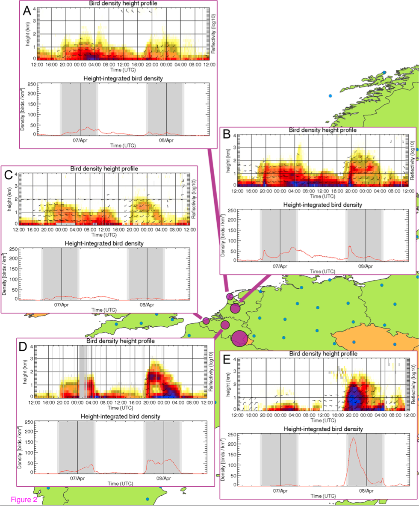

# Description of the case study

This case study focuses on a week of intense bird migration across Belgium and the Netherlands, from April 5 to 11, 2013. Spring 2013 was one of the coldest springs recorded over the last 40 years, with temperatures 4 degrees below average[^1].
We begin the series on April 5, 2013 during the phase with little or no migration, and winds blowing predominantly to the SW. The following night between April 6 and 7 started with moderate NE migration, but was overruled after midnight with mass arrival of birds from the UK. Notice the increassing speed and change in direction just after midnight, April 7 2013, 01:00 hrs.

## Complex weather conditions

During the coming nights weather conditions become very complex with extreme differences in wind conditions at different radar sites, even within this small area and differences at the different pressure levels. At the surface, winds in the Netherlands, especially in the North and along the coast, are blowing towards the SW, whereas at higher altitudes winds are blowing towards the WSW, which results in layering occurring at several radar sites, but not all (figure 1).

[^1]: http://www.knmi.nl/klimatologie/maand_en_seizoensoverzichten/seizoen/len13.html

_**Figure 1**: **Mass bird migration observed on five operational weather radars.** Nocturnal bird migration measured by two operational weather radars in the Netherlands (a. Den Helder and b. De Bilt) and three operational weather radars in Belgium (c. Jabbeke, d. Zaventem, and e. Wideumont) on April 7 and 8, 2013 (for locations see pink circles on map, blue circles indicate other weather radars in the vicinity). The size of the pink circles represent the height-integrated bird density (birds/km2) on April 8, 2013 at peak migration. Colours in upper graphs of each subplot indicate bird density (number of birds/km3) with the wind barbs indicating the birds’ ground speed and direction, lower graphs in each subplot indicate the height-integrated bird density (birds/km2), grey areas in these graphs indicate periods between dusk and dawn. (figure from [this publication](doi.org/10.1186/2051-3933-2-9))_

## Peak migration

Perhaps the most dramatic night in this time series is the **night between April 8 and 9**. In some cases during this night radar images seem to be so saturated with birds. Wind speeds in the area reach 12 m/s and higher, very close to the average air speed of migrating passerines, common on such nights. In areas where the wind is blowing in the direction of intended flight (such as in southern Belgium) this is a huge benefit for migrants, but in areas where the wind is blowing in different direction this can cause birds to veer off their intended course and potentially slow down while trying to compensate for wind conditions.

## Second peak

The situation seems to change considerably on the **night between April 10 and 11**. Strong SW to W winds at the beginning of the night triggered large numbers of birds to take-off. A frontal weather system moved over Belgium and the Netherlands, causing a strong S to SW wind flow with wind speeds exceeding 18 m/s. Bird were moving very fast with ground speeds averaging ~30 m/s (>100 km per hour) even during the next morning. The low pressure area moved over the North of the Netherlands later that day, causing opposing winds in the Netherlands at the beginning of the night and following winds in Belgium. Later on, westerlies dominated the night with a nice arrival of birds coming over from the UK in the north, while 'ordinary' NE migration was in place in the rest of our area of interest.
